# 🤖 AgenticBot - ChatGPT Clone with Google ADK

AgentitBot is A powerful multi-agent AI assistant built with Google's Agent Development Kit (ADK) and Firecrawl, featuring web search, content extraction, deep research, and image generation capabilities.

## ✨ Features

- **🤖 Multi-Agent Architecture**: Coordinated system with specialized agents for different tasks
- **🌐 Web Search**: Real-time information retrieval using Firecrawl
- **📄 Web Content Extraction**: Scrape and analyze web pages
- **🔍 Deep Research**: Comprehensive topic research with multiple sources
- **🎨 Image Generation**: Create images using Gemini's Imagen model
- **💬 Interactive CLI**: User-friendly command-line interface
- **🔒 Safety First**: Built-in content filtering and safety guidelines

## 🚀 Quick Start

### Prerequisites

- Python 3.11 or higher
- Conda (recommended) or pip
- Google API Key
- Firecrawl API Key

### 1. Clone and Setup

```bash
# Clone the repository
git clone <repository-url>
cd AgenticBot

# Create and activate conda environment
conda env create -f environment.yml
conda activate agenticbot

# Or use pip
pip install -r app/requirements.txt
```

### 2. Get API Keys

#### Google API Key
1. Go to [Google AI Studio](https://makersuite.google.com/app/apikey)
2. Create a new API key
3. Copy the key

#### Firecrawl API Key
1. Go to [Firecrawl](https://firecrawl.dev)
2. Sign up and get your API key
3. Copy the key

### 3. Configure Environment

```bash
# Navigate to app directory
cd app

# Create .env file
cp .env.template .env

# Edit .env file with your API keys
GOOGLE_API_KEY=your_google_api_key_here
FIRECRAWL_API_KEY=your_firecrawl_api_key_here
```

### 4. Run the Application

```bash
# Start the interactive session
python main.py
```

## 🎯 Usage Examples

Once the application is running, try these example queries:

### General Questions
```
💬 You: Who was Marie Curie?
```

### Web Search
```
💬 You: What's the weather in London right now?
```

### Web Content Extraction
```
💬 You: Extract content from https://github.com/trending
```

### Deep Research
```
💬 You: Do deep research on quantum computing advances
```

### Image Generation
```
💬 You: Generate an image of a robot playing piano
```

## 🧠 Agentic Workflow

```mermaid
flowchart TD
    User["User Query"] -->|"Input"| RootAgent["🤖 Root Agent"]
    RootAgent -->|"Delegates: search, scrape, research, image"| SpecializedAgents["Specialized Agents"]
    SpecializedAgents -->|"Uses Tools/APIs"| Tools["Web Search, Scraper, Research, Image Gen"]
    Tools -->|"Results"| SpecializedAgents
    SpecializedAgents -->|"Response"| RootAgent
    RootAgent -->|"Final Answer"| User
```



## 🔄 Data Workflow


## 🏗️ Architecture

### Multi-Agent System

The application uses a coordinated multi-agent architecture:

- **🤖 Root Agent**: Main coordinator that delegates tasks to specialized agents
- **🔍 Search Agent**: Handles web search queries using Firecrawl
- **📄 Web Extraction Agent**: Extracts and analyzes web content
- **🔬 Research Agent**: Conducts comprehensive topic research
- **🎨 Image Generation Agent**: Creates images using Gemini models

### Tools Available

- **`web_search(query)`**: Search the web for current information
- **`scrape_webpage(url)`**: Extract content from web pages
- **`deep_research(topic)`**: Perform comprehensive research
- **`generate_image(prompt)`**: Create images from text descriptions

## 📁 Project Structure

```
AgenticBot/
├── environment.yml          # Conda environment configuration
├── pyproject.toml          # Project configuration
├── README.md               # This file
└── app/
    ├── main.py             # Main application entry point
    ├── requirements.txt    # Python dependencies
    ├── .env.template       # Environment variables template
    └── chatgpt_agentic_clone/
        ├── __init__.py     # Package initialization
        └── agent.py        # Multi-agent system implementation
```

## 🔧 Configuration

### Environment Variables

| Variable | Description | Required |
|----------|-------------|----------|
| `GOOGLE_API_KEY` | Google AI API key for Gemini models | ✅ |
| `FIRECRAWL_API_KEY` | Firecrawl API key for web search/scraping | ✅ |

### Model Configuration

The application uses these Gemini models:
- **Text Generation**: `gemini-2.0-flash-exp`
- **Image Generation**: `imagen-3.0-generate-001`

## 🧰 Tech Stack

| Layer         | Technology / API         | Purpose                                 |
|---------------|--------------------------|-----------------------------------------|
| Language      | Python 3.11+             | Core application                        |
| AI Models     | Google Gemini, Imagen    | Text & image generation                 |
| Web Search    | Firecrawl                | Real-time web search & scraping         |
| Framework     | Streamlit                | Web frontend (chat UI)                  |
| CLI           | Rich, Prompt Toolkit     | Interactive command-line interface      |
| Env Mgmt      | Conda, pip               | Dependency management                   |
| Config        | dotenv                   | API key management                      |

## 🌐 Streamlit Frontend

A beautiful web-based chat UI is available! It supports:
- Chat with the AI assistant
- Special commands (search, scrape, research, image)
- Tool/action trace display

### To run the Streamlit app:

```bash
cd app
streamlit run streamlit_app.py
```

Open the provided local URL in your browser to use the web interface.

## 🛠️ Development

### Adding New Tools

1. Define the tool function in `agent.py`
2. Add it to the appropriate agent's tools list
3. Update agent instructions if needed

### Adding New Agents

1. Create the agent with specific tools and instructions
2. Add it to the root agent's sub_agents list
3. Update the root agent's instructions

### Customizing Agent Instructions

Each agent has customizable instructions that define its behavior and safety guidelines. Edit the `instruction` parameter in the agent definitions.

## 🔒 Safety and Ethics

The application includes built-in safety measures:

- **Content Filtering**: Agents are instructed to avoid harmful content
- **Ethical Guidelines**: Built-in instructions to prevent misuse
- **Source Attribution**: Web search results include source URLs
- **Transparency**: Clear indication of when tools are being used

## 🐛 Troubleshooting

### Common Issues

**"Model not found" error**
- Ensure your Google API key is valid
- Check that the model names are correct (without "models/" prefix)

**"Session not found" error**
- The application automatically creates sessions
- If this persists, restart the application

**"API key not configured" error**
- Check your `.env` file exists in the `app` directory
- Verify API keys are correctly set

**"Firecrawl error"**
- Ensure your Firecrawl API key is valid
- Check your internet connection

### Debug Mode

For detailed error information, check the console output. The application provides verbose logging for troubleshooting.

## 📚 Dependencies

### Core Dependencies
- `google-adk`: Google Agent Development Kit
- `firecrawl-py`: Firecrawl web scraping and search
- `google-generativeai`: Google Generative AI SDK
- `python-dotenv`: Environment variable management

### Development Dependencies
- `asyncio`: Asynchronous programming
- `base64`: Image data handling
- `os`: Operating system interface

## 🤝 Contributing

1. Fork the repository
2. Create a feature branch
3. Make your changes
4. Test thoroughly
5. Submit a pull request

## 📄 License

This project is licensed under the MIT License - see the LICENSE file for details.

## 🙏 Acknowledgments

- **Google ADK**: For the Agent Development Kit
- **Firecrawl**: For web scraping and search capabilities
- **Gemini**: For powerful AI models
- **Firecrawl Tutorial**: For the original inspiration and guidance

## 📞 Support

If you encounter any issues or have questions:

1. Check the troubleshooting section above
2. Review the console output for error messages
3. Ensure all dependencies are properly installed
4. Verify API keys are correctly configured

---

**Happy coding! 🚀** # AgenticBot
# AgenticBot
