# 🤖 AgenticBot - Advanced Multi-Agent AI Assistant

AgenticBot is a sophisticated multi-agent AI assistant built with Google's Agent Development Kit (ADK) foundations and enhanced with Google Generative AI SDK, featuring coordinated agents for web search, content extraction, deep research, and image generation capabilities using Firecrawl and Gemini models.

## ✨ Features

- **🤖 Multi-Agent Architecture**: Coordinated system with specialized agents for different tasks
- **🌐 Web Search**: Real-time information retrieval using Firecrawl
- **📄 Web Content Extraction**: Scrape and analyze web pages
- **🔍 Deep Research**: Comprehensive topic research with multiple sources
- **🎨 Image Generation**: Create images using Gemini's Imagen model
- **💬 Interactive CLI**: User-friendly command-line interface
- **🖥️ Modern Web UI**: Beautiful Streamlit interface with real-time agentic logging
- **🔍 Agentic Activity Monitoring**: Real-time visualization of agent workflow and tool execution
- **🔒 Safety First**: Built-in content filtering and safety guidelines

## 🚀 Quick Start

### Prerequisites

- Python 3.11 or higher
- Conda (recommended) or pip
- Google API Key
- Firecrawl API Key

### 1. Clone and Setup

```bash
# Clone the repository
git clone https://github.com/nerdy1texan/AgenticBot.git
cd AgenticBot

# Create and activate conda environment
conda env create -f environment.yml
conda activate agenticbot

# Or use pip
pip install -r app/requirements.txt
```

### 2. Get API Keys

#### Google API Key
1. Go to [Google AI Studio](https://makersuite.google.com/app/apikey)
2. Create a new API key
3. Copy the key

#### Firecrawl API Key
1. Go to [Firecrawl](https://firecrawl.dev)
2. Sign up and get your API key
3. Copy the key

### 3. Configure Environment

```bash
# Navigate to app directory
cd app

# Create .env file
cp .env.template .env

# Edit .env file with your API keys
GOOGLE_API_KEY=your_google_api_key_here
FIRECRAWL_API_KEY=your_firecrawl_api_key_here
```

### 4. Run the Application

```bash
# Start the CLI interface
python main.py

# Or start the Streamlit web interface
streamlit run streamlit_app.py
```

## 🎯 Usage Examples

Once the application is running, try these example queries:

### General Questions
```
💬 You: Who was Marie Curie?
```

### Web Search (Explicit Commands)
```
💬 You: search for latest developments in quantum computing
```

### Auto-detected Current Information Queries
```
💬 You: What's the weather in London right now?
💬 You: Latest news on AI developments
💬 You: Current stock market trends
```

### Web Content Extraction
```
💬 You: scrape https://github.com/trending
```

### Deep Research
```
💬 You: research quantum computing advances in 2024
```

### Image Generation
```
💬 You: generate image of a robot playing piano
```

## 🤖 Agent Roles & Responsibilities

### 🎯 Root Agent (Main Coordinator)
- **Primary Role**: Central orchestrator and decision maker
- **Responsibilities**:
  - Receives and analyzes user queries
  - Determines appropriate specialized agent for delegation
  - Coordinates responses from multiple agents
  - Handles general conversation and knowledge queries
  - Ensures safety and ethical guidelines compliance
  - Formats and presents final responses to users
- **Tools**: None (delegates to specialized agents)
- **Decision Logic**: Intent analysis, keyword detection, context understanding

### 🔍 Search Agent (Information Retrieval Specialist)
- **Primary Role**: Real-time web information retrieval
- **Responsibilities**:
  - Execute web searches for current events and real-time data
  - Handle weather, news, sports, and trending topic queries
  - Filter and rank search results for relevance
  - Format search results with proper attribution
  - Detect and handle search-related queries automatically
- **Tools**: `web_search(query)` via Firecrawl API
- **Triggers**: Explicit "search for" commands, current info keywords (weather, news, latest, now, current, today's)

### 📄 Web Extraction Agent (Content Analysis Specialist)
- **Primary Role**: Structured web content extraction and analysis
- **Responsibilities**:
  - Extract content from specific URLs provided by users
  - Parse and structure webpage content (HTML, markdown, text)
  - Extract metadata (titles, descriptions, links)
  - Handle various content formats and website structures
  - Provide content summaries and key insights
- **Tools**: `scrape_webpage(url, format)` via Firecrawl API
- **Triggers**: Explicit "scrape" commands with URLs

### 🔬 Research Agent (Deep Analysis Specialist) 
- **Primary Role**: Comprehensive multi-source research and analysis
- **Responsibilities**:
  - Conduct in-depth research on complex topics
  - Gather information from multiple authoritative sources
  - Synthesize findings into coherent summaries
  - Provide source attribution and credibility assessment
  - Handle academic and professional research queries
- **Tools**: `deep_research(topic, max_depth, time_limit)` via Firecrawl API
- **Triggers**: Explicit "research" commands for complex topics

### 🎨 Image Generation Agent (Creative Visualization Specialist)
- **Primary Role**: Text-to-image generation and creative visualization
- **Responsibilities**:
  - Generate images from textual descriptions
  - Interpret creative prompts and artistic instructions
  - Handle various image styles and formats
  - Process and optimize generated image data
  - Provide image descriptions and generation feedback
- **Tools**: `generate_image(prompt)` via Google Gemini Imagen API
- **Triggers**: Explicit "generate image" commands

## 🧠 Comprehensive Agentic Workflow

### High-Level Agent Coordination

```mermaid
flowchart TD
    User["👤 User Input"] -->|"Query"| RootAgent["🤖 Root Agent<br/>(Central Coordinator)"]
    
    RootAgent -->|"Intent Analysis"| Decision{"🎯 Query Classification"}
    
    Decision -->|"Current Info<br/>Keywords Detected"| SearchAgent["🔍 Search Agent"]
    Decision -->|"URL Provided"| WebAgent["📄 Web Extraction Agent"]
    Decision -->|"Research Request"| ResearchAgent["🔬 Research Agent"]
    Decision -->|"Image Request"| ImageAgent["🎨 Image Generation Agent"]
    Decision -->|"General Knowledge"| RootAgent
    
    SearchAgent -->|"Web Search Results"| RootAgent
    WebAgent -->|"Extracted Content"| RootAgent
    ResearchAgent -->|"Research Summary"| RootAgent
    ImageAgent -->|"Generated Image"| RootAgent
    
    RootAgent -->|"Formatted Response"| User
    
    style RootAgent fill:#e1f5fe
    style SearchAgent fill:#f3e5f5
    style WebAgent fill:#e8f5e8
    style ResearchAgent fill:#fff3e0
    style ImageAgent fill:#fce4ec
```



### Detailed Agent Interaction Flow

```mermaid
sequenceDiagram
    participant U as 👤 User
    participant R as 🤖 Root Agent
    participant S as 🔍 Search Agent
    participant W as 📄 Web Agent
    participant Re as 🔬 Research Agent
    participant I as 🎨 Image Agent
    participant API as 🌐 External APIs
    
    U->>R: User Query
    R->>R: Analyze Intent & Context
    
    alt Search Query
        R->>S: Delegate to Search Agent
        S->>API: Firecrawl Search API
        API-->>S: Search Results
        S->>S: Filter & Format Results
        S-->>R: Processed Results
    
    else URL Scraping
        R->>W: Delegate to Web Agent
        W->>API: Firecrawl Scrape API
        API-->>W: Webpage Content
        W->>W: Parse & Structure Content
        W-->>R: Extracted Content
    
    else Research Request
        R->>Re: Delegate to Research Agent
        Re->>API: Firecrawl Deep Research API
        API-->>Re: Multi-source Data
        Re->>Re: Synthesize Findings
        Re-->>R: Research Summary
    
    else Image Generation
        R->>I: Delegate to Image Agent
        I->>API: Google Gemini Imagen API
        API-->>I: Generated Image
        I->>I: Process Image Data
        I-->>R: Image + Metadata
    
    else General Query
        R->>API: Google Gemini Text API
        API-->>R: Generated Response
    end
    
    R->>R: Format Final Response
    R-->>U: Complete Answer
```



### Real-Time Agent Activity Monitoring

The application now features real-time agentic activity logging that shows:

```mermaid
flowchart LR
    A["📨 Query Received"] --> B["🔍 Intent Analysis"]
    B --> C["🎯 Agent Selection"]
    C --> D["🔧 Tool Preparation"]
    D --> E["🌐 API Execution"]
    E --> F["📊 Result Processing"]
    F --> G["📝 Response Formatting"]
    G --> H["🎉 Task Completion"]
    
    style A fill:#e3f2fd
    style B fill:#f3e5f5
    style C fill:#e8f5e8
    style D fill:#fff3e0
    style E fill:#fce4ec
    style F fill:#f1f8e9
    style G fill:#ede7f6
    style H fill:#e0f2f1
```



## 🔄 Data & Information Flow Architecture

### System-Level Data Flow

```mermaid
flowchart TB
    subgraph "User Interface Layer"
        CLI["🖥️ CLI Interface<br/>(main.py)"]
        WEB["🌐 Web Interface<br/>(streamlit_app.py)"]
    end
    
    subgraph "Agent Orchestration Layer"
        ROOT["🤖 Root Agent<br/>(Central Coordinator)"]
        INTENT["🎯 Intent Analysis<br/>(Query Classification)"]
    end
    
    subgraph "Specialized Agent Layer"
        SEARCH["🔍 Search Agent<br/>(Real-time Info)"]
        SCRAPE["📄 Web Extraction Agent<br/>(Content Analysis)"]
        RESEARCH["🔬 Research Agent<br/>(Deep Analysis)"]
        IMAGE["🎨 Image Generation Agent<br/>(Creative AI)"]
    end
    
    subgraph "Tool & API Layer"
        FC_SEARCH["🌐 Firecrawl Search API"]
        FC_SCRAPE["🕸️ Firecrawl Scrape API"]
        FC_RESEARCH["🔬 Firecrawl Research API"]
        GEMINI_TEXT["🧠 Google Gemini Text API"]
        GEMINI_IMAGE["🎨 Google Imagen API"]
    end
    
    subgraph "Data Storage Layer"
        SESSION["💾 Session State"]
        LOGS["📋 Activity Logs"]
        HISTORY["📚 Chat History"]
    end
    
    CLI --> ROOT
    WEB --> ROOT
    ROOT --> INTENT
    INTENT --> SEARCH
    INTENT --> SCRAPE
    INTENT --> RESEARCH
    INTENT --> IMAGE
    
    SEARCH --> FC_SEARCH
    SCRAPE --> FC_SCRAPE
    RESEARCH --> FC_RESEARCH
    IMAGE --> GEMINI_IMAGE
    ROOT --> GEMINI_TEXT
    
    FC_SEARCH --> SESSION
    FC_SCRAPE --> SESSION
    FC_RESEARCH --> SESSION
    GEMINI_TEXT --> SESSION
    GEMINI_IMAGE --> SESSION
    
    SESSION --> LOGS
    SESSION --> HISTORY
    
    style ROOT fill:#e1f5fe,stroke:#01579b
    style SEARCH fill:#f3e5f5,stroke:#4a148c
    style SCRAPE fill:#e8f5e8,stroke:#1b5e20
    style RESEARCH fill:#fff3e0,stroke:#e65100
    style IMAGE fill:#fce4ec,stroke:#880e4f
```



## 🏗️ Architecture & Design Patterns

### Multi-Agent System Design

The application implements several key architectural patterns:

#### 1. **Delegation Pattern**
- Root Agent acts as a central dispatcher
- Specialized agents handle domain-specific tasks
- Clear separation of concerns and responsibilities

#### 2. **Tool-Agent Binding**
- Each agent is equipped with specific tools for their domain
- Tools are abstracted as functions with standardized interfaces
- Agents focus on coordination while tools handle execution

#### 3. **Intent-Based Routing**
- Automatic query classification and routing
- Multiple triggers for agent selection (explicit commands, keyword detection)
- Fallback to general conversation handling

#### 4. **Safety-First Design**
- Built-in safety instructions for all agents
- Content filtering and ethical guidelines
- Source attribution and transparency

### Tools Available to Agents

| Tool Function | Purpose | API Integration | Response Format |
|---------------|---------|-----------------|-----------------|
| `web_search(query)` | Real-time web search | Firecrawl Search | JSON with results array |
| `scrape_webpage(url, format)` | Content extraction | Firecrawl Scrape | JSON with content + metadata |
| `deep_research(topic, depth, time)` | Multi-source research | Firecrawl Research | JSON with summary + sources |
| `generate_image(prompt)` | Text-to-image generation | Google Imagen | JSON with base64 image data |

## 📁 Project Structure

```
AgenticBot/
├── environment.yml                    # Conda environment configuration
├── pyproject.toml                     # Project configuration
├── README.md                          # This comprehensive documentation
├── requirements.txt                   # Python dependencies
└── app/
    ├── main.py                        # CLI application entry point
    ├── streamlit_app.py               # Web UI with agentic activity monitoring
    ├── requirements.txt               # App-specific Python dependencies
    ├── .env.template                  # Environment variables template
    ├── README.md                      # App-specific documentation
    ├── tests/                         # Test files directory
    │   ├── test_direct_agent.py       # Direct agent testing
    │   ├── test_explicit_agent.py     # Explicit agent testing
    │   └── [other test files]         # Various testing approaches
    └── chatgpt_agentic_clone/
        ├── __init__.py                # Package initialization
        └── agent.py                   # Multi-agent system implementation
```

## 🔧 Configuration & Environment

### Environment Variables

| Variable | Description | Required | Default |
|----------|-------------|----------|---------|
| `GOOGLE_API_KEY` | Google AI API key for Gemini models | ✅ | None |
| `FIRECRAWL_API_KEY` | Firecrawl API key for web search/scraping | ✅ | None |

### Model Configuration

The application uses these Google AI models:
- **Text Generation**: `gemini-2.0-flash-exp` (Latest experimental model)
- **Image Generation**: `imagen-3.0-generate-001` (Advanced image synthesis)

### Agent Configuration Parameters

Each agent can be customized with:
- **Instructions**: Behavior and safety guidelines
- **Tools**: Available functions and APIs
- **Model**: Specific Gemini model to use
- **Sub-agents**: Hierarchical agent relationships

## 🧰 Technology Stack & Integrations

| Layer | Technology / API | Version | Purpose |
|-------|------------------|---------|---------|
| **Language** | Python | 3.11+ | Core application development |
| **AI Framework** | Google Generative AI SDK | Latest | Direct model integration |
| **Agent Development** | Google ADK Foundations | Conceptual | Multi-agent architecture design |
| **AI Models** | Google Gemini 2.0 Flash | Experimental | Text generation and reasoning |
| **Image AI** | Google Imagen 3.0 | Latest | High-quality image generation |
| **Web Intelligence** | Firecrawl | Latest | Web search, scraping, research |
| **Web Framework** | Streamlit | Latest | Interactive web frontend |
| **CLI Framework** | Rich + Prompt Toolkit | Latest | Beautiful command-line interface |
| **Environment** | Conda, pip | Latest | Dependency and environment management |
| **Configuration** | python-dotenv | Latest | Environment variable management |
| **Data Handling** | Base64, JSON | Built-in | Image and structured data processing |

## 📊 Google ADK Role in Development Journey

### Initial Development with Google ADK

AgenticBot was originally conceived and started using **Google's Agent Development Kit (ADK)**, which provided the foundational concepts and architecture for multi-agent systems:

#### 🎯 ADK Contributions:
- **Agent Architecture Design**: Multi-agent coordination patterns
- **Tool Integration Framework**: Standardized tool-agent binding approach
- **Safety Guidelines**: Built-in ethical AI practices
- **Session Management**: Conversation state and context handling

#### 🔄 Migration to Direct Integration:

During development, we encountered several challenges with the ADK Runner:
- **API Compatibility Issues**: Message formatting validation errors
- **Model Integration Complexity**: Complex model name handling requirements
- **Session Management Overhead**: Additional abstraction layers

### Current Implementation Strategy

```mermaid
flowchart LR
    subgraph "Development Evolution"
        ADK["🏗️ Google ADK<br/>(Architecture Foundation)"] --> CONCEPTS["📋 Design Patterns<br/>& Concepts"]
        CONCEPTS --> DIRECT["🎯 Direct Integration<br/>(Google GenAI SDK)"]
    end
    
    subgraph "Retained ADK Elements"
        MULTI["🤖 Multi-Agent Design"]
        TOOLS["🔧 Tool Integration"]
        SAFETY["🔒 Safety Guidelines"]
        COORD["🎯 Agent Coordination"]
    end
    
    subgraph "Enhanced Implementation"
        STREAMLIT["🌐 Streamlit UI"]
        LOGGING["📋 Activity Monitoring"]
        DIRECT_API["⚡ Direct API Calls"]
    end
    
    CONCEPTS --> MULTI
    CONCEPTS --> TOOLS
    CONCEPTS --> SAFETY
    CONCEPTS --> COORD
    
    DIRECT --> STREAMLIT
    DIRECT --> LOGGING
    DIRECT --> DIRECT_API
    
    style ADK fill:#e3f2fd
    style DIRECT fill:#e8f5e8
    style CONCEPTS fill:#fff3e0
```



### Benefits of Hybrid Approach:
1. **ADK Design Principles**: Robust multi-agent architecture
2. **Direct SDK Integration**: Simplified API interaction
3. **Enhanced Flexibility**: Custom UI and monitoring capabilities
4. **Better Performance**: Reduced abstraction overhead

## 🌐 Advanced Streamlit Frontend Features

### Real-Time Agentic Activity Monitoring

The Streamlit interface provides unprecedented visibility into the agent workflow:

#### 🔍 Activity Log Categories:
- **🤖 Agent Steps**: High-level agent coordination and decision making
- **🔧 Tool Execution**: Preparation and setup of specialized tools
- **🌐 API Calls**: External service integration and data retrieval
- **📊 Result Processing**: Data analysis and response formatting

#### 🎨 Visual Design Features:
- **Glassmorphism Effects**: Modern translucent design elements
- **Color-Coded Agents**: Visual distinction between different agent types
- **Real-Time Updates**: Live streaming of agent activity
- **Expandable Sections**: Organized information display
- **Dark Mode Optimized**: Professional appearance with excellent readability

### Web Interface Capabilities:
```bash
cd app
streamlit run streamlit_app.py
```

Features include:
- 💬 Interactive chat interface
- 🔍 Real-time agentic workflow visualization
- 🔧 Tool execution monitoring
- 📊 Response formatting display
- 🎨 Image generation and display
- 📱 Responsive design for mobile and desktop

## 🛠️ Advanced Development & Customization

### Adding New Agents

1. **Define Agent Role**:
```python
new_specialist_agent = Agent(
    name="new_specialist",
    model=MODEL_GEMINI_2_0_FLASH,
    instruction="Your specialized role and guidelines...",
    tools=[new_tool_function],
)
```

2. **Add to Root Agent**:
```python
root_agent = Agent(
    # ... existing configuration
    sub_agents=[
        # ... existing agents
        new_specialist_agent,
    ],
)
```

3. **Update Intent Detection**:
- Add trigger keywords or patterns
- Update routing logic in main application

### Creating Custom Tools

1. **Define Tool Function**:
```python
def custom_tool(parameter: str) -> Dict:
    """Custom tool for specific functionality."""
    try:
        # Implementation logic
        result = process_parameter(parameter)
        return {"status": "success", "data": result}
    except Exception as e:
        return {"status": "error", "error_message": str(e)}
```

2. **Add Logging Integration**:
```python
def custom_tool_with_logging(parameter: str) -> Dict:
    print(f"--- Tool: custom_tool called for: {parameter} ---")
    # ... implementation
```

3. **Bind to Agent**:
```python
agent = Agent(
    tools=[custom_tool, other_tools...]
)
```

### Customizing Agent Instructions

Agents can be fine-tuned by modifying their instruction parameters:

```python
instruction="""
You are a [ROLE] specialist. Your responsibilities include:
1. [Primary responsibility]
2. [Secondary responsibility]
3. [Safety guidelines]

IMPORTANT GUIDELINES:
- [Specific guideline 1]
- [Specific guideline 2]
- [Safety consideration]
"""
```

## 🔒 Enhanced Safety & Ethics Framework

### Multi-Layer Safety Approach

1. **Agent-Level Safety**:
   - Individual agent instructions include safety guidelines
   - Role-specific ethical considerations
   - Built-in refusal mechanisms for harmful requests

2. **Tool-Level Safety**:
   - Input validation and sanitization
   - Error handling and graceful failures
   - Rate limiting and resource management

3. **System-Level Safety**:
   - Content filtering at integration points
   - Source attribution and transparency
   - User activity monitoring and logging

### Ethical AI Implementation:
- **Transparency**: Clear indication of AI-generated content
- **Attribution**: Source citation for web-sourced information
- **Privacy**: No storage of sensitive user information
- **Accountability**: Comprehensive activity logging
- **Bias Mitigation**: Diverse source integration for research

## 🐛 Comprehensive Troubleshooting Guide

### Common Issues & Solutions

#### Google API Integration
```bash
# Issue: "Model not found" error
# Solution: Ensure correct model name format
✅ Correct: "gemini-2.0-flash-exp"
❌ Incorrect: "models/gemini-2.0-flash-exp"
```

#### Firecrawl Integration
```bash
# Issue: "API key not configured"
# Solution: Check environment variable setup
export FIRECRAWL_API_KEY="your_key_here"
# Or ensure .env file is properly configured
```

#### Agent Communication Issues
```bash
# Issue: Agents not responding correctly
# Solutions:
1. Check agent instructions for clarity
2. Verify tool function implementations
3. Review error logs for specific issues
4. Test individual tools separately
```

#### Streamlit Interface Issues
```bash
# Issue: Interface not loading correctly
# Solutions:
1. Clear browser cache
2. Restart Streamlit server
3. Check console for JavaScript errors
4. Verify all dependencies are installed
```

### Debug Mode Activation

Enable detailed logging by setting environment variable:
```bash
export DEBUG_MODE=true
```

This provides:
- Detailed API request/response logging
- Agent decision-making process details
- Tool execution step-by-step breakdown
- Performance timing information

## 📚 Dependencies & Requirements

### Core Dependencies
```yaml
# Production Dependencies
google-generativeai: "Latest"  # Direct Google AI integration
firecrawl-py: "Latest"         # Web intelligence platform
streamlit: "Latest"            # Web interface framework
python-dotenv: "Latest"        # Environment management
google-adk: "Latest"           # Agent architecture foundations

# Development Dependencies
pytest: "Latest"               # Testing framework
black: "Latest"                # Code formatting
flake8: "Latest"               # Code linting
mypy: "Latest"                 # Type checking
```

### System Requirements
- **Python**: 3.11 or higher
- **Memory**: 4GB RAM minimum, 8GB recommended
- **Storage**: 2GB free space
- **Network**: Stable internet connection for API calls
- **Browser**: Modern browser for Streamlit interface

## 🤝 Contributing & Development

### Contribution Guidelines

1. **Fork and Clone**:
```bash
git fork https://github.com/nerdy1texan/AgenticBot.git
git clone your-fork-url
cd AgenticBot
```

2. **Create Feature Branch**:
```bash
git checkout -b feature/your-feature-name
```

3. **Development Setup**:
```bash
conda env create -f environment.yml
conda activate agenticbot
cd app && cp .env.template .env
# Add your API keys to .env
```

4. **Testing**:
```bash
python -m pytest app/tests/
```

5. **Submit Pull Request**:
- Ensure all tests pass
- Include comprehensive documentation
- Follow existing code style and patterns

### Development Priorities
- 🔄 Enhanced agent coordination algorithms
- 🎯 Additional specialized agents (data analysis, code generation)
- 🌐 Extended API integrations
- 📊 Advanced analytics and monitoring
- 🎨 UI/UX improvements and accessibility
- 🔒 Enhanced security and privacy features

## 📞 Support & Community

### Getting Help

1. **Documentation**: Review this comprehensive README
2. **Console Logs**: Check terminal output for detailed error information
3. **Testing**: Run individual components to isolate issues
4. **Community**: Join discussions and contribute to improvements

### Reporting Issues

When reporting issues, please include:
- Python version and operating system
- Complete error messages and stack traces
- Steps to reproduce the issue
- Environment configuration (API keys status, dependencies)
- Expected vs actual behavior

## 📄 License & Acknowledgments

### License
This project is licensed under the MIT License - see the LICENSE file for details.

### Acknowledgments & Credits

- **🏗️ Google ADK Team**: For the foundational multi-agent architecture concepts and design patterns
- **🧠 Google Gemini**: For state-of-the-art language and image generation models
- **🔥 Firecrawl**: For comprehensive web intelligence and data extraction capabilities
- **🌐 Streamlit**: For the intuitive web application framework
- **🤖 Open Source Community**: For continuous inspiration and collaborative development
- **📚 Research Community**: For advancing the field of multi-agent AI systems

### Special Recognition
This project demonstrates the evolution from using Google ADK as a foundation to implementing a production-ready system with direct API integration, showcasing the practical application of agentic AI principles in real-world scenarios.

---

**🚀 Ready to explore the future of multi-agent AI? Start your AgenticBot journey today!**

*Built with ❤️ by the open source community, powered by cutting-edge AI technologies.*
